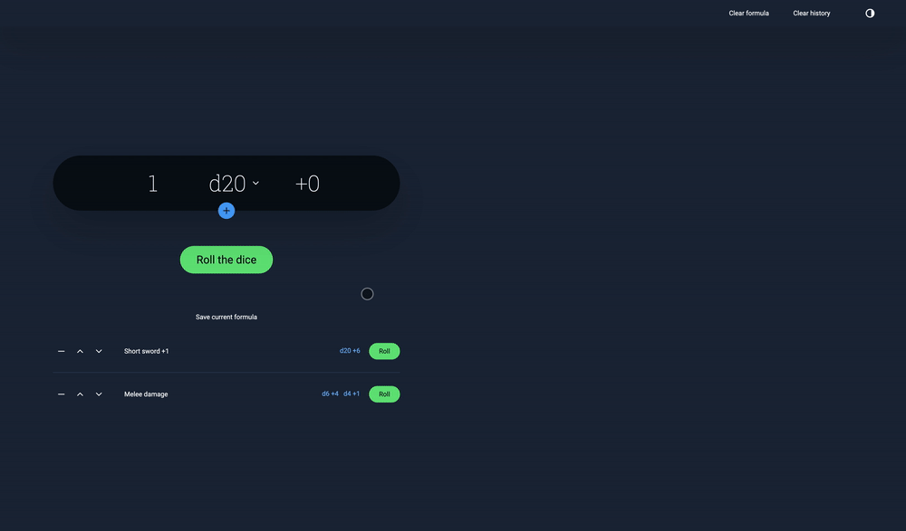

# Dice Roller
A dice roller for RPGs or table top game

## [See it in action](https://zombiefox.github.io/nightTab/)

### Features

- Roll any combination of d2, d3, d4, d6, d8, d10, d12, d20 or d100
- Formulas, eg: can roll `3 d6 +5` or `100 d12 +100 & 50 d20 + 50`
- Saved formulas
- Record roll history
- Responsive layout
- Dark and light theme

### Development

To develop run:
- `npm i`
- `npm run start`

The project can be viewed locally at: `http://0.0.0.0:8080/`.

To build run:
- `npm i`
- `npm run build`

A web ready folder will be created at: `/dist/`.
